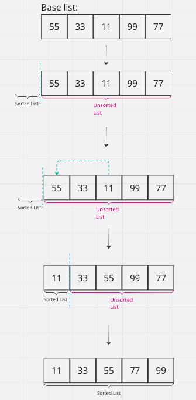

# SELECTION SORT ALGORITHM
Simple, yet effective, this algorithm consist in separate the array in two parts: the sorted part (more on left) and the unsorted part (more on right); 

# How it works:
This algorithm repeatedly selects the smallest (or largest) element from the unsorted part and swap it to the sorted part. 

To do that, it save the current value as the small one and scan all the list, looking for a new value even smaller than the current small value selected. If this value is found, the algorithm swap positions of the current position with the smaller value found and move to the next position doing the same until it finish.

Ex:

# Step by Step

1) List: `[55, 33, 11, 99, 77]`;
2) Current position: index 0; value 55; The smallest value of this list is 11 at position 2;
3) Swap position 0 (val 55) with position 2 (val 11): `[11, 33, 55, 99, 77]`;
4) Move to the next position: index 1;
5) Index 1 (val 33) is the smallest value from the remaining list, so do nothing and move to the next position;
6) Index 2 (val 55) is the smallest value from the remaining list, so do nothing and move to the next position;
7) Current position: index 3; value 99; The smallest value of the remaining list is 77 at position 4;
8) Swap position 3 (val 99) with the position 4 (val 77): `[11, 33, 55, 77, 99]`;
9) Move to the next position: index 4;
10) index 4 is the last index, so finish the execution;
